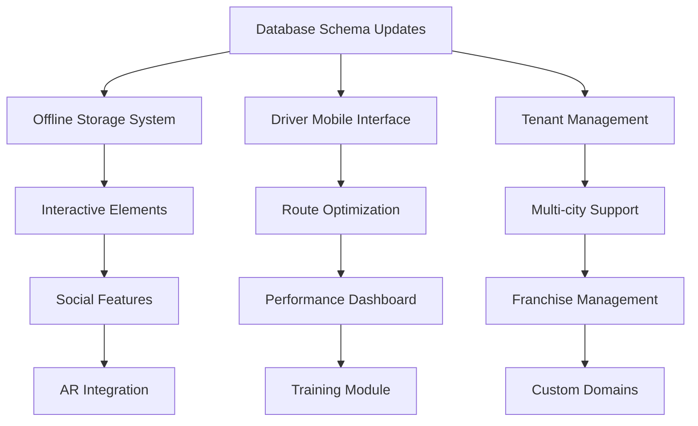

# AudioGuide Advanced Features Implementation Roadmap

## Overview
This document provides a comprehensive roadmap for implementing advanced features across three major areas: Advanced Tour Features, Enhanced Driver Experience, and Multi-tenant Architecture.

## Project Structure

```
.kiro/specs/
├── 00-implementation-roadmap.md          # This file - overall project plan
├── 01-advanced-tour-features.md          # Offline, AR, Interactive, Social, AI features
├── 02-enhanced-driver-experience.md      # Mobile app, optimization, training, performance
└── 03-multi-tenant-architecture.md       # White-label, multi-city, franchise, domains
```

## Implementation Timeline

### Phase 1: Foundation (Weeks 1-4)
**Focus**: Core infrastructure and high-impact features

#### Week 1-2: Advanced Tour Features - Foundation
- **Offline Mode**: Core download and storage system
- **Interactive Elements**: Basic quiz and poll components
- **Database Schema**: Create tables for offline content and interactions

#### Week 3-4: Driver Experience - Core
- **Driver Mobile App**: Responsive interface and basic functionality
- **Performance Dashboard**: Key metrics and basic analytics
- **Database Schema**: Driver sessions, performance, and availability tables

### Phase 2: Enhancement (Weeks 5-8)
**Focus**: Feature completion and user experience

#### Week 5-6: Social & Personalization
- **Social Features**: Photo sharing, reviews, and basic social feed
- **Personalized Recommendations**: Basic algorithm and user preferences
- **Multi-tenant Foundation**: Tenant management and basic branding

#### Week 7-8: Driver Advanced Features
- **Route Optimization**: Basic route planning and traffic integration
- **Earnings Tracking**: Financial reporting and payment history
- **Training Module**: Core training system and progress tracking

### Phase 3: Advanced Features (Weeks 9-12)
**Focus**: Advanced functionality and optimization

#### Week 9-10: AR and Advanced Interactions
- **AR Integration**: WebXR implementation and 3D content
- **Advanced Interactive Elements**: Photo challenges and gamification
- **Multi-city Support**: City management and localized content

#### Week 11-12: Multi-tenant Complete
- **Franchise Management**: Revenue sharing and hierarchical permissions
- **Custom Domains**: Domain setup and SSL automation
- **Performance Optimization**: Caching, CDN, and scalability improvements

## Feature Dependencies

### Critical Path Dependencies


### Parallel Development Tracks
1. **Track 1**: Offline Mode → Interactive Elements → AR Integration
2. **Track 2**: Driver Mobile App → Route Optimization → Training Module
3. **Track 3**: Tenant Management → Multi-city → Franchise Management

## Technical Architecture

### Database Schema Priority
```sql
-- Phase 1: Core tables
- tour_downloads, offline_content_cache
- driver_app_sessions, driver_availability, driver_performance_metrics
- tenants, tenant_branding, tenant_features

-- Phase 2: Feature tables
- interactive_content, user_interactions, user_achievements
- social_posts, social_interactions, user_connections
- user_preferences, recommendation_models

-- Phase 3: Advanced tables
- ar_content, ar_interactions
- training_modules, driver_training_progress
- franchises, franchise_roles, tenant_domains
```

### Service Layer Architecture
```
src/services/
├── OfflineManager.js           # Phase 1
├── TenantService.js           # Phase 1
├── DriverPerformanceService.js # Phase 1
├── SocialService.js           # Phase 2
├── RecommendationEngine.js    # Phase 2
├── RouteOptimizationService.js # Phase 2
├── ARContentService.js        # Phase 3
├── TrainingService.js         # Phase 3
└── FranchiseService.js        # Phase 3
```

## Quality Assurance Strategy

### Testing Approach
Following the steering rules for testing and quality:

#### Unit Testing (80%+ coverage target)
- **Offline sync logic**: Data consistency and conflict resolution
- **Route optimization algorithms**: Efficiency and accuracy
- **Recommendation engine**: Algorithm correctness
- **Tenant isolation**: Data security and separation
- **Financial calculations**: Earnings and revenue accuracy

#### Integration Testing
- **Cross-feature workflows**: Offline → Online sync
- **Multi-tenant data isolation**: Tenant boundary enforcement
- **Payment processing**: End-to-end financial flows
- **AR content loading**: Performance and reliability
- **Social sharing**: Privacy and permissions

#### Performance Testing
- **Offline storage limits**: Large dataset handling
- **AR rendering**: Frame rate and memory usage
- **Multi-tenant scalability**: Concurrent tenant load
- **Route optimization**: Response time under load
- **Database queries**: Query optimization and indexing

### Security Implementation
Following security steering rules:

#### Data Protection
- **Tenant data isolation**: Row-level security policies
- **Offline content encryption**: Local storage security
- **Financial data protection**: PCI compliance measures
- **Location data privacy**: GPS data anonymization
- **Social content moderation**: Content filtering and reporting

#### Authentication & Authorization
- **Multi-tenant access control**: Tenant-aware permissions
- **Driver mobile security**: Secure token management
- **Franchise hierarchy**: Role-based access control
- **API rate limiting**: Tenant-specific throttling
- **Audit logging**: Comprehensive activity tracking

## Development Environment Setup

### Required Dependencies
```json
{
  "new-dependencies": {
    "@tensorflow/tfjs": "^4.0.0",        // AI recommendations
    "three": "^0.150.0",                 // 3D/AR rendering
    "workbox-webpack-plugin": "^6.5.0",  // Offline functionality
    "mapbox-gl": "^2.15.0",             // Route optimization
    "socket.io-client": "^4.7.0",       // Real-time features
    "pdf-lib": "^1.17.0",               // Report generation
    "sharp": "^0.32.0",                 // Image processing
    "node-cron": "^3.0.0"               // Scheduled tasks
  }
}
```

### Environment Configuration
```bash
# Additional environment variables needed
MAPBOX_ACCESS_TOKEN=your_mapbox_token
TENSORFLOW_BACKEND=webgl
OFFLINE_STORAGE_QUOTA=500MB
AR_CONTENT_CDN_URL=https://ar-content.yourapp.com
FRANCHISE_COMMISSION_RATE=0.10
```

## Risk Assessment & Mitigation

### High-Risk Areas
1. **AR Browser Compatibility**: Limited WebXR support
   - *Mitigation*: Progressive enhancement with fallbacks
   
2. **Offline Data Synchronization**: Conflict resolution complexity
   - *Mitigation*: Last-write-wins with user conflict resolution UI
   
3. **Multi-tenant Performance**: Database query performance
   - *Mitigation*: Proper indexing and query optimization
   
4. **Route Optimization Accuracy**: Real-world traffic variations
   - *Mitigation*: Machine learning model training with historical data

### Medium-Risk Areas
1. **Mobile App Performance**: Battery and memory usage
2. **Social Content Moderation**: Inappropriate content handling
3. **Financial Calculations**: Accuracy in complex scenarios
4. **Custom Domain SSL**: Certificate automation reliability

## Success Metrics

### Technical KPIs
- **Code Coverage**: >80% for critical paths
- **Performance**: <2s page load times
- **Uptime**: 99.9% availability
- **Security**: Zero data breaches
- **Scalability**: Support 1000+ concurrent users per tenant

### Business KPIs
- **Feature Adoption**: >60% user engagement with new features
- **Tenant Satisfaction**: >4.5/5 rating
- **Driver Efficiency**: 20% improvement in route optimization
- **Revenue Growth**: 30% increase from advanced features
- **User Retention**: 15% improvement in monthly active users

## Resource Requirements

### Development Team
- **2 Full-stack Developers**: Core feature development
- **1 Mobile Developer**: Driver app optimization
- **1 DevOps Engineer**: Infrastructure and deployment
- **1 QA Engineer**: Testing and quality assurance
- **1 UI/UX Designer**: User experience optimization

### Infrastructure
- **Database**: Upgraded Supabase plan for increased capacity
- **CDN**: Content delivery for AR assets and media
- **Monitoring**: Application performance monitoring tools
- **Testing**: Automated testing infrastructure
- **Security**: Security scanning and audit tools

## Next Steps

### Immediate Actions (Week 1)
1. **Review and approve specifications**
2. **Set up development environment**
3. **Create database migration scripts**
4. **Initialize project structure**
5. **Set up CI/CD pipeline**

### Week 1 Deliverables
1. **Database schema migrations** for Phase 1 tables
2. **Basic offline storage service** implementation
3. **Driver mobile app** responsive layout
4. **Tenant management** core functionality
5. **Testing framework** setup and initial tests

---

**Ready to Begin**: This roadmap provides a structured approach to implementing advanced features while maintaining code quality, security, and performance standards. Each phase builds upon the previous one, ensuring a stable and scalable implementation.

Choose which specification to start with, and I'll begin the detailed implementation!